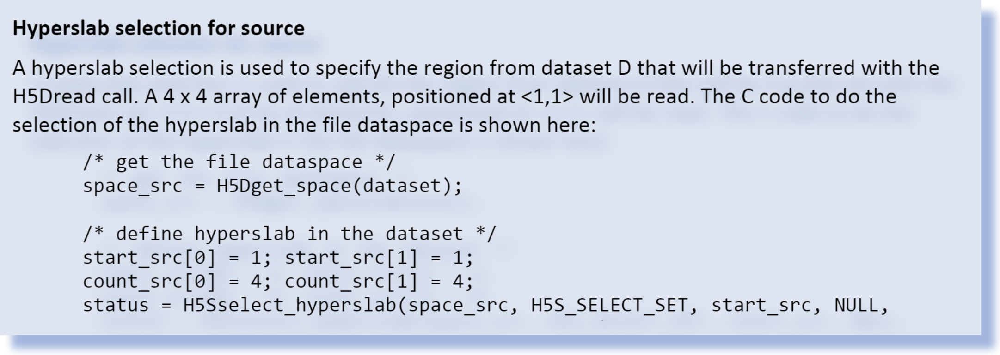
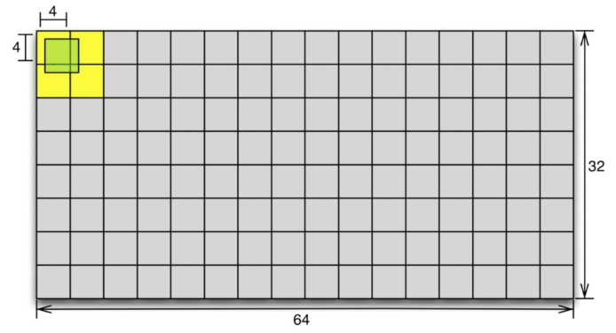
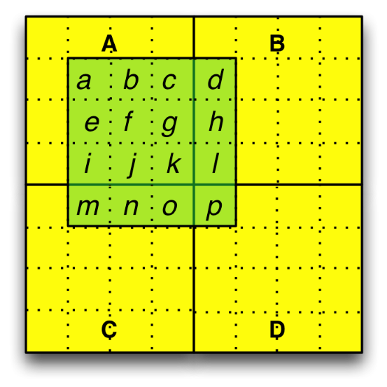
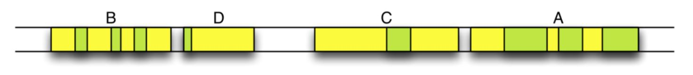
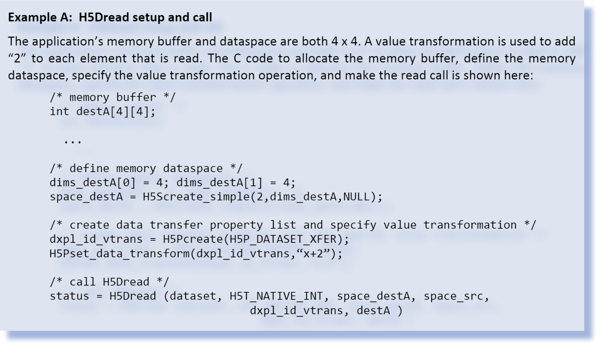
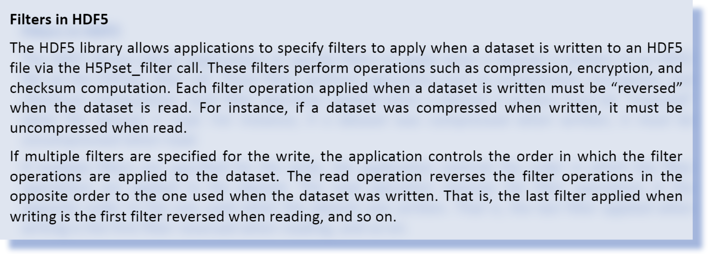
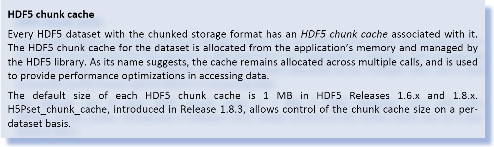
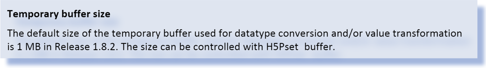

# HDF5 Data Flow Pipeline for H5Dread

This document describes the HDF5 library’s data movement and processing activities when H5Dread is called for a dataset with chunked storage. The document provides an overview of how memory management, filter operations, datatype conversions, and value transformations occur as data is transferred from an HDF5 file to an application’s memory buffer. The intended audience includes application HDF5 developers who would like a better understanding of HDF5’s handling of filters, datatype conversions, and value transformations, or who are concerned with performance tuning and memory management, in the context of H5Dread.

## Contents

* <a href="#intro">Introduction</a>
* <a href="#examples">Examples</a>
    * <a href="#data-to-be-read">Data to be read</a>
    * <a href="#exampleA">Example A</a>
    * <a href="#exampleB">Example B</a>
* <a href="#data-flow-pline">Data Flow Pipeline</a>
    * <a href="#step-1">Step 1: Read chunk from disk</a>
    * <a href="#step-2">Step 2: Reverse filter(s)</a>
        * <a href="#compute-verify-chsum">Compute and verify checksum</a>
        * <a href="#uncompress">Uncompress data</a>
    * <a href="#step-3">Step 3: Put chunk in cache or heap</a>
    * <a href="#step-4">Step 4: Allocate temporary buffer for datatype conversion / value transformation</a>
    * <a href="#step-5">Step 5: Copy array elements to temporary buffer</a>
    * <a href="#step-6">Step 6: Perform datatype conversion</a>
    * <a href="#step-7">Step 7: Perform value transformation</a>
    * <a href="#step-8">Step 8: Copy elements from temporary buffer to application’s buffer</a>
    * <a href="#step-9">Step 9: Scatter elements from chunk to application’s buffer</a>
    * <a href="#step-10">Step 10: Free memory</a>
    * <a href="#step-10">Step 11: Return from H5Dread</a>
* <a href="#activity-diagram">H5Dread Activity Diagram</a>
* <a href="#acknowledgement">Acknowledgements</a>
* <a href="#rev-history">Revision History</a>
* <a href="#suggested-revs">Suggested Revisions</a>

<h2 id="intro">Introduction</h2>
This document outlines how data stored in the chunked storage format moves from an HDF5 file on disk into an application’s memory buffer when H5Dread is called.

Section 2 introduces two slightly different H5Dread examples that incorporate filters, datatype conversions, and value transformations. Section 3 follows the path of data from disk to application memory, giving a step-by-step explanation of the data flow pipeline for the two examples.

Sections 2 and 3 include code samples, references to HDF5 APIs, and notes about default buffer sizes that are not crucial to the description of pipeline data movement and processing activities. This information, which appears in highlighted boxes, is included to help readers connect the pipeline description to options provided by the HDF5 library for controlling behavior and tuning performance during the H5Dread call. Note that the code samples do not include error checking.

A UML activity diagram that summarizes the data movement and processing steps in the pipeline is presented in Section 4. The activity diagram gives a high-level view of the operations that are examined in detail in Section 3. Some readers may prefer to review Section 4 prior to reading Sections 2 and 3.

<h2 id="examples">2. Examples</h2>
Two example H5Dread requests are described in this section. Both examples read the same data from an HDF5 file stored on disk. The data and buffer sizes used in the examples are unrealistically small, but serve the purpose of illustrating the pipeline.

In the first example, the data read completely fills the application’s memory buffer, overwriting all data that is initially in the buffer. In the second example, the application’s buffer is larger than the data read, so only some of the data in the buffer is overwritten. The first example applies a value transformation to the data being read from disk, while the second does not.

In both examples, the file datatype is different than the memory datatype, so a datatype conversion is done as part of the read operation.

<h3 id="data-to-be-read">Data to be read</h3>
An HDF5 file stored on disk has a dataset, D. In both of the examples, a region of dataset D will be read. The desired region is 4 elements x 4 elements, with the first element to be read at index <1,1>.

HDF5 dataset D has these characteristics:

* Number of dimensions: 2
* Dimension sizes: 32 x 64
* Chunked storage with chunks of size 4x4
* 32-‐bit integer atomic datatype
* Little-­endian representation
* Compressed with the DEFLATE filter
* Fletcher 32 checksum filter applied

Region of Interest:

* Number of dimensions: 2
* Dimension sizes: 4 x 4
* Offset in dataset: <1,1>

Therefore:

* Total cells in array equals: 32 * 64 = 2048
* Size of array (uncompressed) is: 2048 * 4 bytes = 8192 bytes
* Each chunk has uncompressed size of: 4*4*4 = 64 bytes
* There are 128 chunks in the file
* Total cells in region of interest equals: 4 * 4 = 16
* Size of region of interest (uncompressed) is : 16 * 4 bytes = 64 bytes

Figure 1 shows a conceptual representation of dataset D with uncompressed data. The desired region and the chunks that contain it are shown in green and yellow, respectively.

Figure 1: Conceptual representation of dataset D

In Figure 1, the chunks and region of interest are represented by the yellow and green areas of the diagram. Figure 2 shows an enlarged view of the region and chunks, with labels added. The dashed lines delineate individual elements in the dataset. Elements in the region of interest have been labeled so they can be traced through the pipeline process.

Figure 2: Conceptual representation of region and chunks in dataset D

Figure 3 shows a more accurate depiction of the chunks and elements in the region as they could be laid out on disk. Note that data in each chunk is stored contiguously on disk, and that the chunks have unequal sizes due to compression of the data.

Figure 3: Conceptual representation of chunks and region elements on disk

<h3 id="exampleA">Example A</h3>
In the first example, the application’s memory buffer is a 4 x 4 array. Every element in the array will be filled with elements read from dataset D, so no hyperslab selection is needed for the destination dataspace.

The application’s memory buffer characteristics are:

* Number of dimensions: 2
* Dimension sizes: 4 x 4
* 64­‐bit integer atomic datatype
* Big‐endian representation

Therefore:

* Total cells in array equals: 4 * 4 = 16
* Size of array is: 16 * 8 bytes = 128 bytes

In this example, the application includes a value transformation in the data transfer property list for the H5Dread call. The transformation specifies that the integer value “2” should be added to each element in the region of interest before it is copied to the application’s memory buffer.

<h3 id="exampleB">Example B</h3>
In the second example, the application’s memory buffer is2 ax 16 array. The 16 elements read will be distributed non-sequentially in the application’s buffer, as described by a hyperslab selection in the memory dataspace parameter.

The application memory buffer characteristics are:

Number of dimensions: 2
Dimension sizes: 2 x 16
64 bit Integer atomic datatype
Big­‐endian representation
Therefore:

Total cells in array equals: 2 * 16 = 32
Size of array is: 32 * 8 bytes = 256 bytes
No value transformation is applied in this example.

<h2 id="data-flow-pline"> Data Flow Pipeline</h2>
The HDF5 library performs a series of steps when H5Dread is called. For datasets with chunk storage, each chunk that contains data to be read is individually processed. After all of the chunks have been read and processed, the library returns from the H5Dread call.

The steps in the data flow processing pipeline for the H5Dread call are detailed here, using the examples outlined in the previous section to illustrate the process.

<h3 id="step-1">Step 1: Read chunk from disk</h3>
The HDF5 library reads a chunk of the dataset that contains data in the region of interest from disk. For the given examples, chunk A would be read the first time this step executes. Steps 2‐9 are applied to each chunk.

If one or more filters were applied when the dataset was written, as they were in the given examples, processing continues with Step 2. Otherwise, processing continues with Step 3.

<h3 id="step-2">Step 2: Reverse filter(s)</h3>

In dataset D, two filters were applied when the data was written. The DEFLATE compression filter was applied first, followed by the Fletcher 32 checksum filters. The last filter applied when the dataset was written, the checksum filter, is reversed first in the H5Dread processing pipeline.

<h4 id="compute-verify-chsum">Compute and verify checksum</h4>
Using memory in the application’s memory space (heap) that is managed by the HDF5 library, the HDF5 library computes the checksum for the current chunk and compares it to the saved value. If there is a checksum mismatch and error detection is enabled, the H5Dread call will return an error at this point. Otherwise, processing continues.

<h4 id="uncompress">Uncompress data</h4>
Again using memory in the application’s memory space (heap) that is managed by the HDF5 library, the DEFLATE filter is reversed and the current chunk is uncompressed.

<h3 id="step-3">Step 3: Put chunk in cache or heap</h3>

If there is sufficient space in dataset D’s chunk cache, the data for the current chunk is stored there. Otherwise, it is temporarily stored on the heap in memory managed by the HDF5 library. Data in the chunk cache always has the disk datatype representation and is always in the “filters reversed” form.

In the given examples, the uncompressed data for the current chunk will be stored. A chunk cache of at least 64 bytes is needed to hold a single chunk of uncompressed data for dataset D.

Figure 4: Steps 1-3 of data flow pipeline

Steps 1, 2, and 3 are represented graphically in Figure 4. At this point, all filters have been reversed (checksum and decompression in the given examples), and the datatype matches its representation in the file (32-bit little­‐endian integer in this case).

If no datatype conversion is needed and no value transformation is specified, processing continues with Step 9 for each chunk. 

Example A involves datatype conversion and value transformation, and Example B involves datatype conversion, so Steps 4­‐8 are performed for both examples. 

<h3 id="step-4">Step 4: Allocate temporary buffer for datatype conversion / value transformation</h3>
The first time the HDF5 library is ready to perform a datatype conversion and/or value transformation for a given H5Dread call, HDF5 allocates a temporary buffer in the application’s memory to perform the necessary operations on the array elements in the region of interest.

The number of bytes needed to process one dataset array element depends on the “larger” of the file and memory datatypes. In the given examples, the memory datatype (64 bit integer) is larger than the disk datatype (32 bit integer). Therefore, it will take 8 bytes (64 bits) in the temporary buffer to process one dataset array element.

For the purpose of explanation, assume the temporary buffer is 64 bytes. In the given examples, up to eight elements of the dataset (64 bytes in buffer/ 8 bytes per element) can be resident in the temporary buffer at any given time.

The following steps are taken for each chunk.

<h3 id="step-5">Step 5: Copy array elements to temporary buffer</h3>
Unprocessed elements in the region of interest are gathered from the chunk cache (or the HDF5-managed memory on the heap if the chunk cache was too small) into the temporary buffer. The size of the temporary buffer determines the maximum number of elements that can be gathered at one time.

Considering chunk A in the examples, eight of the nine elements that are of interest will fit into the temporary buffer. Figure 5 depicts the temporary buffer at this stage of the pipeline.

Figure 5: Temporary buffer with first eight elements in region

<h3 id="step-6">Step 6: Perform datatype conversion</h3>
If the memory representation is not the same as the disk representation, datatype conversion is performed by the HDF5 library on the values in the temporary buffer.

In the examples, the values will be converted from 32-bit little-endian integers into 64­‐bit big­‐endian integers. Figure 6 illustrates the contents of the temporary buffer after the datatype conversion.

Figure 6: Temporary buffer with first eight elements after datatype conversion

<h3 id="step-7">Step 7: Perform value transformation</h3>
If the property list used in H5Dread includes a data transformation, as it does in Example A, the algebraic operation specified in the transformation is applied to each element in the temporary buffer by the HDF library.

In Example A, each of the eight 64­‐bit big­‐endian integers in the temporary buffer will have 2 added to it. For instance, if element c in the array had the value 65 in the HDF5 file on disk, it will have the value 67 in the temporary buffer after Step 7 completes.

<h3 id="step-8">Step 8: Copy elements from temporary buffer to application’s buffer</h3>
The HDF library scatters elements from the temporary buffer into the application’s memory buffer, using offsets computed from the hyperslab selections specified in the dataspace parameters of the H5Dread call.

Figure 7 represents the contents of the application’s memory buffer for Example A after this step completes the first time. The elements in the application’s memory buffer have been converted into the memory datatype and have had the value transformation applied.

Figure 7: Application's memory buffer after first pass through Step 8 for Example A

Figure 8 represents the contents of the application’s memory buffer for Example B after Step 8 completes the first time. The elements in the application’s memory buffer have been converted into the memory datatype. No value transformation is applied in Example B.

Figure 8: Application's memory buffer after first pass through step 8 in Example B

Steps 5-8 are repeated until all elements in the region of interest for the current chunk have been processed and copied into the application’s memory buffer.

Steps 1-8 are repeated until all chunks containing data in the region of interest have been processed and all requested data has been copied into the application’s memory buffer.

After all requested data in the region of interest has been processed and copied into the application’s memory buffer, the HDF5 library continues with Step 10.

<h3 id="step-9">Step 9: Scatter elements from chunk to application’s buffer</h3>
This step is not performed for either Example A or Example B.

If no datatype conversion is needed and no value transformation is specified, this step follows Step 3. In this step, the HDF5 library copies the elements in the region of interest for the current chunk from the memory it manages (chunk cache or heap) into the application’s memory buffer. This gather/scatter operation is based on the chunk and application buffer offsets the library computes from the hyperslab selections specified in the file and memory dataspace parameters used in the H5Dread call.

Steps 1-3 and 9 are repeated until all chunks containing data in the region of interest have been processed and all requested data has been copied into the application’s memory buffer.

After all requested data in the region of interest has been processed and copied into the application’s memory buffer, the HDF5 library continues with Step 10.

<h3 id="step-10">Step 10: Free memory</h3>
The HDF5 library frees the memory it allocated in the course of performing Steps 1-9. Note that memory allocated to the chunk cache is not freed until the dataset is closed.

<h3 id="step-11">Step 11: Return from H5Dread</h3>
With the requested data in the application’s memory buffer, and the memory used to perform the processing associated with the read released, the HDF5 library returns from the H5Dread call.

Figure 9 shows the contents of the application’s memory buffer when H5Dread returns for Example A, and Figure 10 shows the results for Example B.

Figure 9: Application's memory buffer when H5Dread returns for Example A

Figure 10: Application's memory buffer when H5Dread returns for Example B

<h2 id="activity-diagram">H5Dread Activity Diagram</h2>
Figure 11 shows a UML activity diagram for the H5Dread call when a dataset with chunked storage layout is being read. The diagram shows the activities involved fulfilling the read request, without the step­‐by­‐step detail given in Section 3.

Figure 11: H5Dread activity diagram

<h2 id="acknowledgement">Acknowledgements</h2>
This document was written as background material for a specific project. The principal author was Ruth Aydt. Quincey Koziol provided information about the HDF5 library’s behavior, patiently answering questions, and correcting technical errors in the document. Mike Folk provided advice on document structure and presentation.

<h2 id="rev-history">Revision History</h2>

|                   |                                                              |
| ----------------- | ------------------------------------------------------------ |
| April 8, 2009        | Circulated for comment among selected parties.
| April 12, 2009    | Incorporated feedback; circulated for comment.
| April 12, 2009    | Incorporated feedback; circulated for comment.
| April 15, 2009    | Corrected errors in V2; circulated to The HDF Group for comment.
| June 8, 2009      | Updated Figure 8; posted on website.
| December 29, 2010 | Light editorial pass. Modified for inclusion in HDF5 product documentation as draft. Add to collection Advanced Topics in HDF5 |
| August 30, 2017   | Converted to web document; updated errors in figure numbering (Names for figures 8 and 9 were used twice.)

<h2 id="suggested-revs">Suggested Revisions</h2>
 These suggested revisions were deferred due to time constraints. Readers are encouraged to send additional suggestions for improving the document to docs@hdfgroup.org. 

* Add a simpler example with no chunking, no filters, and no subsetting. This would document how things are different without chunked storage, and introduce the concepts more gradually.
* Move the Activity Diagram to the beginning of the document, and add text explaining it. Possibly add another activity diagram that shows the data flow pipeline in less detail, then show the detailed version.
* Provide rigorous definitions of the terms used, either by referencing definitions provided elsewhere, or including definitions in this document.
* Revisit special formatting used for code examples and information about HDF5 library settings and APIs. Current format emphasizes the sections, which were meant to be “technical asides”.
* Consider adding explicit discussions about performance issues.
* Remove details about default buffer sizes from this document, as they can change with different versions. Perhaps put the information in a summary table that will be updated for each release so that it can be referenced from this document.
